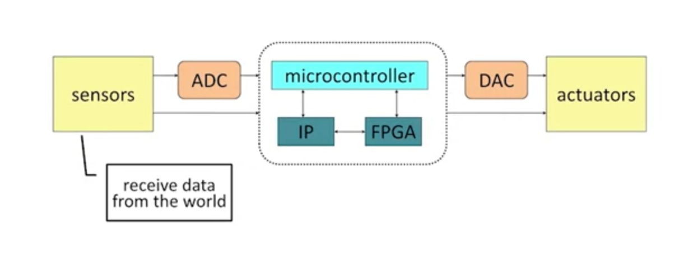

# IoT Course - Module 1: Week 2 - Lecture 1

- [IoT Course - Module 1: Week 2 - Lecture 1](#iot-course---module-1-week-2---lecture-1)
  - [Objectives of week 2](#objectives-of-week-2)
  - [Lecture 1.1: What Are Embedded Systems?](#lecture-11-what-are-embedded-systems)
    - [So, what's a embedded system?](#so-whats-a-embedded-system)
    - [Efficiency matters a lot on embedded systems](#efficiency-matters-a-lot-on-embedded-systems)
  - [Lecture 1.2: More on Embedded Systems](#lecture-12-more-on-embedded-systems)
    - [Embedded systems are application specific](#embedded-systems-are-application-specific)
    - [On embedded systems hardware and software are often designed together](#on-embedded-systems-hardware-and-software-are-often-designed-together)
  - [Lecture 1.3: Generic Embedded Systems Structure](#lecture-13-generic-embedded-systems-structure)
    - [Sensors and actuators](#sensors-and-actuators)
    - [IP](#ip)
    - [FPGA](#fpga)

## Objectives of week 2

- Define what an embedded system is in terms of its interface
- Enumerate and describe the components of an embedded system
- Describe the interactions of embedded systems with the physical world

## Lecture 1.1: What Are Embedded Systems?

It's important to know what an Embedded system is, because the term still is commonly used. What we are building on this course are typically embedded systems.

### So, what's a embedded system?

A simple and straightforward definition is a computer based system that don't look like a computer. If you have a laptop, imagine you would install a software on it, sometimes is easy, but sometimes it have some compatibility conflicts. For example, a friend could not play a game because the GPU driver didn't support it at that time. In this case, he could not play PowerWash Simulator without updating the GPU driver, so there's this whole interaction. The functions are not separated, this is different than an IoT device. An IoT device basically has one function, like the car. It does the car things, right. A camera does camera things, but a general purpose computer it can do a lot of things, and so there can be conflicts. If I install a software to play a video game, that might interfere with the software to do something else. So these relationships add to complexity and it's harder to use a computer than an IoT device.

Now an embedded system, and IoT devices are generally embedded, they hide the complexity from the user. Imagine an IoT scale, so the user doesn't have to see the complexity of what's going on inside. The user just knows how to use it, so it has a very simple interface and this is where the term embedded comes from. The complexity is embedded inside the device, the user doesn't have to deal with the complexity.

An important thing to note is that embedded systems can be different from IoT devices. IoT devices are almost always connected to the internet, thus the term Internet of Things. Embedded systems may or may not be. Embedded systems may have computational complexity in there, but no network connection at all.

In summary, a embedded system is almost the same thing as an IoT device, but it may or may not have internet connection.

### Efficiency matters a lot on embedded systems

So what that generally means is that it's not enough to get the design to work, to do its task. It has to do its task in an elegant, let's say an elegant way, okay Either it has to do it fast, or it has to do it with low power, or it has to do it at low price, right? So it's not enough just to get it to work. The reason for these constraints is that, you know, most of these devices are used in cost critical markets. Or in life critical, right? So if it's using medical or military, people's lives depend on these devices. And if using cost-critical device that compute consumer electronics, the cost is important.

## Lecture 1.2: More on Embedded Systems

This lecture will talk about embedded systems a little bit more. We'll talk in more detail about how they're designed, since that is the point of this course. We're gonna be building IoT devices, which are embedded systems.

### Embedded systems are application specific

Embedded systems are made to do one thing or one related set of things. That's typically how embedded systems are and the reason why this is important is because it changes the way you design a device. When you know that the device is gonna do one thing, you design it for the one thing, you don't design it for everything. So say you get a quad-core i7, something like this, it's running at 4 GHz, right? Generally, there is no way that regular users are using up all the computational potential of that machine. There is no reason why you need four processors to run Word or PowerPoint, or whatever application you're running. You don't need 4 GHz to run these applications. So 99.9% of the time, these laptops and desktops are well under utilized. But then every once in a while, you actually need them to do something that actually uses all of the CPU processing power. In some sense, general-purpose processors, most of the time, they are wasted. There's no reason to have all that power except in very rare cases. Maybe I'm playing a video game. Video games are another case where you really use a computational power, because they're doing video operations all the time. Graphics, complicated graphics. So when I'm playing In my video game, okay, I need the processing power, but most of the time I don't need it. So in some sense, general purpose machines are very inefficient in that way, and because of that they cost more than they need to, to do any individual task.

### On embedded systems hardware and software are often designed together

Another big difference in the way you design embedded systems as compared to sort of a regular desktop laptop, is that hardware and software are usually designed together. So again, this is for efficiency reasons. But if, say you want to buy Microsoft Word or something, some typical desktop software. Maybe I bought my computer from Dell and I bought Word from Microsoft. Two different companies. One does the hardware, one does the software.

Now, more and more, these companies are coming together and sort of Apple is the epitome of this, right? They make their devices' hardware and software together. They make the phone and the software or whatever the device is in the software, as one. Which means that they work together better, okay? And in fact, the Apple machines traditionally are very reliable because of that. But it also makes them more efficient. So you can say, look, since this is just a phone, I don't need to be able to drive servos or something, right? I can make my hardware just the right hardware to run exactly the software that I need. You can match them. Your whole design process gets more efficient.

## Lecture 1.3: Generic Embedded Systems Structure

This lecture we'll talk about the structure of an embedded system. The hardware structure specifically, look at the different components. A very generic view and we'll talk about some of them. The main component, the microcontroller we'll talk more about in the next lecture.

### Sensors and actuators

Above we can see a generic view of what an embedded system looks like. So if you look at an embedded system, it's got to take data from the outside world and then it's gotta output data to the outside world. So it has, first for the receiving data from the outside world, it has a set of sensors. So these sensors they receive information from the outside in many different ways because there are lots of different types of sensors. The most basic type of sensor would be a button. Then there's also, for instance, you could receive sound information like the microphone in front of me, or actually connected to here. And that receives audio information. There's also video, like the webcam of my laptop in front of me, or just a regular light sensor that receives video information. In summary, there's all kinds of sensors. So that input comes in to a set of sensors and it's gonna go into the core of the system and in the end, once the system has decided, process that information, decide what to do with that information, it needs to cause some results. An effect to happen in the outside world. So that's done through the actuators at the other side, the actuators, they cause events to happen in the world. So those might be something like an LED, or something like that. And there are also lots of actuators, motors, lights, speakers, etc.

So if you look at the embedded system, it's in between there, right? It receives data from the sensors, it does something with the data, and then it outputs to the actuators to make something happen in the real world as a result of the data that it received.**The interface components are the sensors and the actuators**.

Now in the middle of the system, the center of the whole thing is that microcontroller in the center. Now, the microcontroller we will talk about in the next lecture in more detail. but there are other components that are commonly inside the core of an embedded system as well, and you see two of them right there. IP and FPGA, we'll talk about those in a little bit right now.

### IP

IP stands for intellectual property, or IP Core, and intellectual property core is basically a predesigned component, typically a premanufactured component so an integrated circuit, a chip that performs one function. When I say one function, maybe a set of functions, but all related to one particular task. So it's a chip that is not general purpose programmable. It's a core that just performs some small set of functions that are all related.

They're useful for common tasks, that's the best thing. In order to make sure you get high volume, you basically wanna have, you wanna use them for very common tasks. Tasks that happen over and over because there's a lot of need. So if it's just a one-off if this is a design, some kind of function that's only done in this one system, then you would almost certainly not make an IP core and make a special purpose chip just for that.  So, for instance, network controllers, right? That's in a lot of systems. Basically every Internet linked device has some sort of network controller in it. So that type of thing you might implement as an IP core. Now these IP cores, we're not designing them in this class, that's outside of the scope of the class, but when you're making an IoT System, you definitely might want to buy one of these. So you'll look at a library, an online library, of IP cores, find some vendor, Texas Instruments, say, they sell a lot of chips that do different things, and you find the one that does exactly what you want.

And they have to interact with a microcontroller. So remember that the microcontroller is the center of all the action right? So, it's connected to the IP cores and it tells them when to do what they need to do. Right, so if an IP core is for encoding video, the microcontroller will say  encode this data now. And when I say it will say that, it means, I mean through the signals, so the wires It will send the appropriate sequence of input signals to trigger it to record. And then the results may be the core sets a signal high when it's completed. And that goes back to the microcontroller. So there's this conversation between the micro controller and the IP core that goes on. And so you have to wire it appropriately and we'll only touch on that.

### FPGA

Now another component that you often find in IoT devices, embedded devices in general, are Field Programmable Gate Arrays. Now, we will not be using Field Programmable Gate Arrays in this class because their complexity is basically outside of the scope of the class, but what they are, they're an interesting thing and you should know what they are. They're hardware. They're integrated circuits, they're chips. These things can be reconfigured, essentially rewired to perform different tasks. Let's say you need something to do audio filtering. So, you might configure the FPGA to perform filtering. Now it's not programmable in the sense of a general purpose processor, you don't write code for it and as a result it's actually a lot faster than a general purpose processor right. So when you make an IP core and you fabricate it as a chip. You have to fabricate it. You have to manufacture chips and that's expensive. So it only makes sense in high volume with FPGAs you don't have to fabricate you just reconfigure it through programming, just connect it by USB to a computer and you can rewire the thing. So that's much more convenient and cheaper, so if you have a one off design you would implement in an FPGA over some kind of an IP core.
