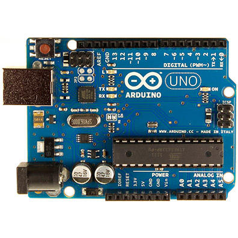

# IoT Course - Module 1: Week 2 - Lecture 2

- [IoT Course - Module 1: Week 2 - Lecture 2](#iot-course---module-1-week-2---lecture-2)
  - [Lecture 2.1: Components of Embedded Systems](#lecture-21-components-of-embedded-systems)
    - [Okay, but what is a microcontroller?](#okay-but-what-is-a-microcontroller)
    - [Sure... But what is the difference from a microprocessor?](#sure-but-what-is-the-difference-from-a-microprocessor)
    - [Microcontrollers must be programmed](#microcontrollers-must-be-programmed)
  - [Lecture 2.2: More on Components of Embedded Systems](#lecture-22-more-on-components-of-embedded-systems)
    - [Sensors](#sensors)
    - [Actuators](#actuators)

## Lecture 2.1: Components of Embedded Systems

This lecture we'll talk about components in embedded systems, the hardware components. Specifically we're gonna talk about microcontrollers.

Here is a picture of a Arduino Board. There are a lot of Arduino boards, this particular board, you can see there's a big chip in there, that black chip over there. This is a microcontroller.

### Okay, but what is a microcontroller?

So a microcontroller is an integrated circuit that executes a program. We're not gonna go into depth about how these things are made. But these chips, they're made out of silicon, a semiconductor. So, the microcontroller, its job is to execute code and it's the center of the system. So, it reads inputs from other components and it controls other components.

### Sure... But what is the difference from a microprocessor?

Its just a terminology difference, basically a microcontroller is smaller and weaker from a microprocessor. Basically a microprocessor is more heavy-duty, is very fast, have lots of memory, that sort of thing. On the other hand, a microcontroller is more slimmed down version of an microprocessor, we don't want to overkill the device, we don't want more processing power than what we need. Generally microcontrollers are going to slower than microprocessors and going to have less memory, less of everything roughly.

**Great! Now we know what a microcontroller and it's difference from a microprocessor!**

### Microcontrollers must be programmed

A microcontroller has to be programmed. Typically write the program on a different host processor like your laptop, desktop. So you write the program there, then you process the program, compile or interpret the program. Then, that final version of the compiled program get transferred to the microcontroller. Usually it's done through a piece of hardware like an wire.

## Lecture 2.2: More on Components of Embedded Systems

So as far as processes go and microcontrollers as well, but right now just talking about general purpose processors. You can classify them in two broad categories, general purpose and digital signal processing. So general purpose processors, those are what you see in your standard desktop, laptop. They're used for any application and they include many features. But they are overkill for most features. They have many features that you probably don't even need. But they can handle anything, so any particular task they can do it. They can do it adequately.

But they tend to be more expensive because they're overdesigned, right? They're overengineered, and they have many features that maybe you don't need a lot of them, but they have it just in case. So that's a general purpose processor. There are also digital signal processors which Specific to doing digital signal processing applications. So digital signal processing is basically processing data streams. So audio streams, video streams. These are very common. They have special instructions for that, they have what are called vector instructions. So vector instructions are instructions that do the same thing to lots of different data. So for instance, say you got add right? With add, you might take two numbers and add them together and get a result. A vector add might take 32 numbers, add them to another 32 numbers, and get a 32 number result. So we just did the same thing for many pairs of data, many sets of data. And this is very common in signal processing. So imagine you're processing video, right, you got some image with a million pixels, which isn't even a lot. And you wanna perform some blur or some operation to the pixels, whatever operation you performed to one pixel, you wanna do that to all one million, the same thing. So vector operations are very useful for things like that. You can just do things in parallel very quickly.

### Sensors

Sensors are extremely common, you need some form of sensors, and sensors just receive information from the environment, there are lots of different kinds of sensors. Simple sensors are those that their inputs and outputs are just real numbers. For example, an thermistor, photoresistors, etc. Complex sensors can receive information and more complicated data. For example, take a CMOS Camera, a digital camera. A digital camera just don't tell if it has light or don't, like a photoresistor. It also tells the color of that light in every point of the image. So it's much more complicated visual data that this thing is reporting. So it can't just give you one number, zero to five yes, this is bright. No, it's not. It has to give you, say it's a megapixel, a million pixels of image data, to represent what it's capturing. So this is a sensor, it's still receiving data from the outside world. But it's a much more complicated sensor, so there's a lot more data to receive and it's more complicated to work with generally.

### Actuators

Actuators, they cause events to occur in the environment, there's some simple ones. LEDs, light emitting diodes, they turn lights off and on. LCDs, liquid crystal displays, that's like what's on my digital watch, you've seen these. You can also have more complicated actuators, like a servo motor, so they're motors, DC motors, servo motors are a little bit more complicated. You can control the angle, the precise angle to which the motor turns, which is useful in a lot of cases.
